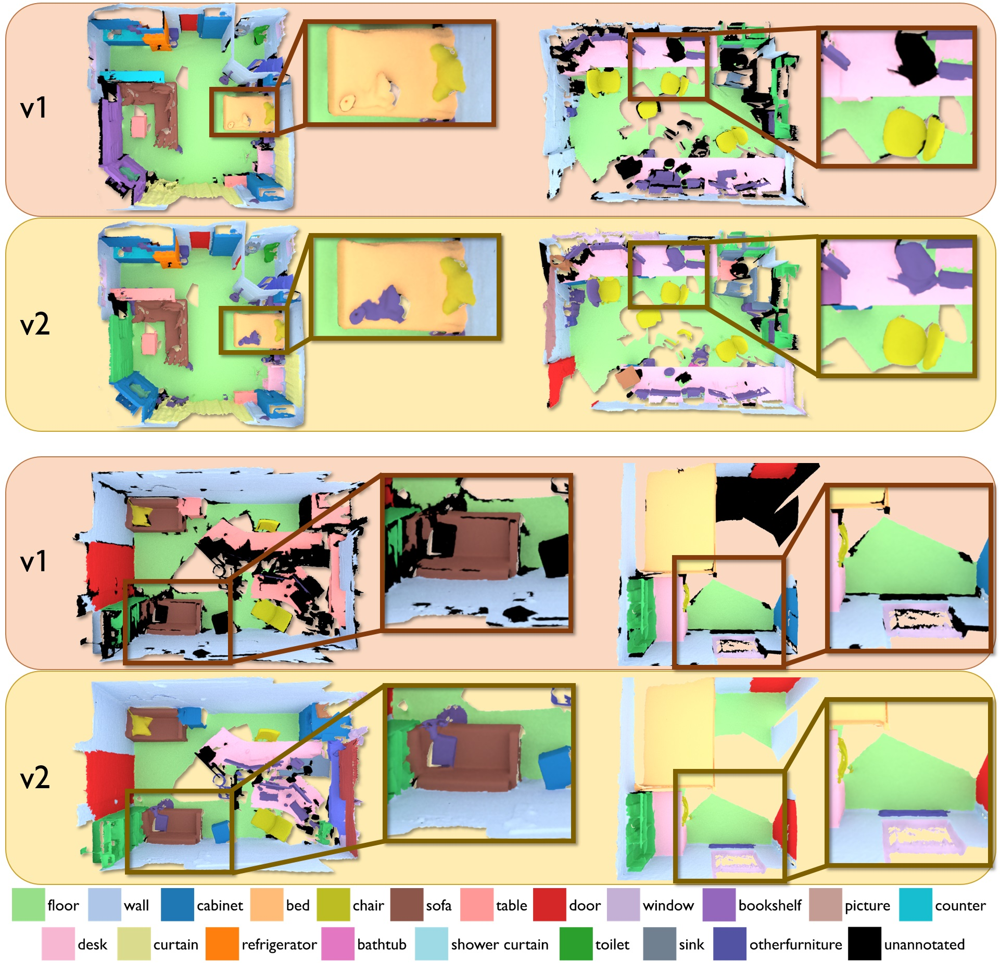

# ScanNet Changelog


## ScanNet v2 (2018-06-11):
- *New 2D/3D benchmark challenge for ScanNet* : Our [ScanNet Benchmark](http://kaldir.vc.in.tum.de/scannet_benchmark) offers both 2D and 3D semantic label and instance prediction tasks, as well as a scene type classification task. 100 new scans are now part of the evaluation test set!
- *New semantic label and instance annotations* : Updated annotations for all 1513 original ScanNet scans, with **approx 90% vs previous 63%** surface coverage. Segments that have been annotated as `remove` are removed from the reconstructed meshes. 
See a colored legend for all nyu40 labels [here](http://kaldir.vc.in.tum.de/scannet_benchmark/img/legend.jpg).
Includes updated files for:
```shell
<scanId>
|-- <scanId>_vh_clean.ply
    (Updated if had remove annotations)
|-- <scanId>_vh_clean_2.ply
    (Updated if had remove annotations)
|-- <scanId>.aggregation.json, <scanId>_vh_clean.aggregation.json
    Updated aggregated instance-level semantic annotations on lo-res, hi-res meshes, respectively
|-- <scanId>_vh_clean_2.labels.ply
    Updated visualization of aggregated semantic segmentation; colored by nyu40 labels (see legend referenced above; ply property 'label' denotes the ScanNet label id)
|-- <scanId>_2d-label.zip
    Updated raw 2d projections of aggregated annotation labels as 16-bit pngs with ScanNet label ids
|-- <scanId>_2d-instance.zip
    Updated raw 2d projections of aggregated annotation instances as 8-bit pngs
|-- <scanId>_2d-label-filt.zip
    Updated filtered 2d projections of aggregated annotation labels as 16-bit pngs with ScanNet label ids
|-- <scanId>_2d-instance-filt.zip
    Updated filtered 2d projections of aggregated annotation instances as 8-bit pngs
```
- *New scene type annotations* : for all 1513 original ScanNet scans, as `sceneType` in the `<scanId>.txt` info file for each scan. All new scene types and label ids are listed [here](http://kaldir.vc.in.tum.de/scannet_benchmark/scene_types_all.txt).
- *New axis alignments* : for all 1513 original ScanNet scans, as `axisAlignment` in the `<scanId>.txt` info file (a 4x4 matrix encoding the rigid transform to axis alignment for the scan, as 16 values in row-major order).
- *Visualization of v2 annotations vs v1 annotations* : 
<a href="img/v2_vs_v1_annotations.jpg"><center>
</center></a>


