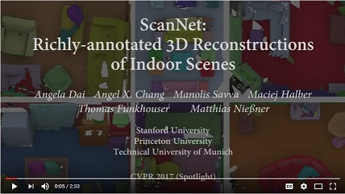
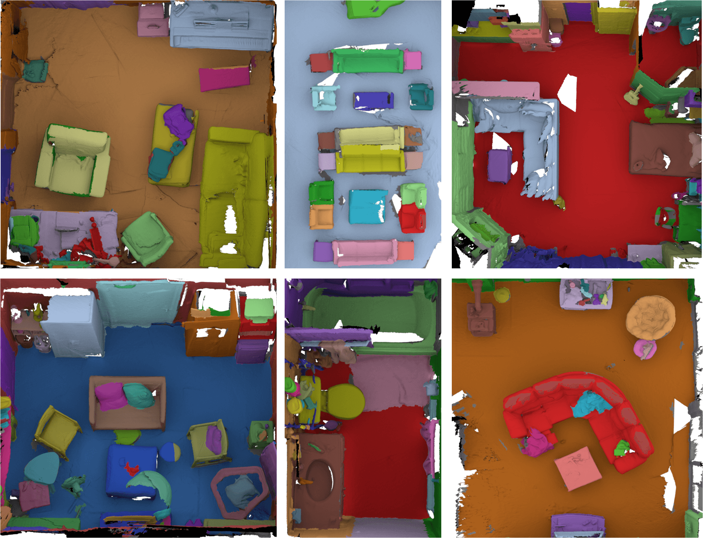
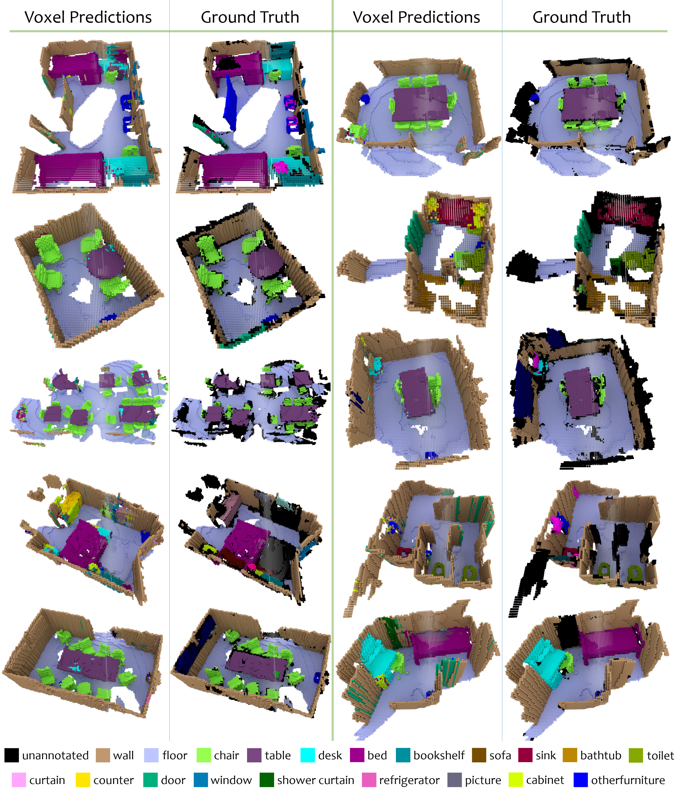

[//]: # (# ScanNet: Richly-annotated 3D Reconstructions of Indoor Scenes)

<script>
  (function(i,s,o,g,r,a,m){i['GoogleAnalyticsObject']=r;i[r]=i[r]||function(){
  (i[r].q=i[r].q||[]).push(arguments)},i[r].l=1*new Date();a=s.createElement(o),
  m=s.getElementsByTagName(o)[0];a.async=1;a.src=g;m.parentNode.insertBefore(a,m)
  })(window,document,'script','https://www.google-analytics.com/analytics.js','ga');

  ga('create', 'UA-77156287-3', 'auto');
  ga('send', 'pageview');

</script>

<h3 id="introduction" align="center">
ScanNet: Richly-annotated 3D Reconstructions of Indoor Scenes<br><br>
<a href="http://cs.stanford.edu/~adai/publications.html">Angela&nbsp;Dai</a>&nbsp;&nbsp;&nbsp;&nbsp;<a href="https://angelxuanchang.github.io">Angel&nbsp;X.&nbsp;Chang</a>&nbsp;&nbsp;&nbsp;&nbsp;<a href="https://msavva.github.io">Manolis&nbsp;Savva</a>&nbsp;&nbsp;&nbsp;&nbsp;<a href="http://www.cs.princeton.edu/~mhalber/">Maciej&nbsp;Halber</a><br><a href="http://www.cs.princeton.edu/~funk/">Thomas&nbsp;Funkhouser</a>&nbsp;&nbsp;&nbsp;&nbsp;<a href="http://graphics.stanford.edu/~niessner/publications.html">Matthias&nbsp;Nie&szlig;ner</a>
</h3>

<h4 align="center">
 Stanford University&nbsp;&nbsp;&nbsp;&nbsp;&nbsp;&nbsp;&nbsp;&nbsp;&nbsp;&nbsp;&nbsp;&nbsp;Princeton University&nbsp;&nbsp;&nbsp;&nbsp;&nbsp;&nbsp;&nbsp;&nbsp;&nbsp;&nbsp;&nbsp;&nbsp;Technical University of Munich
</h4>

<br>
<a href="http://www.youtube.com/watch?v=Olx4OnoZWQQ">

</a>

ScanNet is an RGB-D video dataset containing 2.5 million views in more than 1500 scans, annotated with 3D camera poses, surface reconstructions, and instance-level semantic segmentations.
To collect this data, we designed an easy-to-use and scalable RGB-D capture system that includes automated surface reconstruction and crowdsourced semantic annotation. 
We show that using this data helps achieve state-of-the-art performance on several 3D scene understanding tasks, including 3D object classification, semantic voxel labeling, and CAD model retrieval.
More information can be found in our <a href="https://arxiv.org/abs/1702.04405">paper</a>.

<a href="http://www.robustvision.net"><center>
</center></a>
<center>Submit to the Robust Vision Challenge <a href="http://dovahkiin.stanford.edu/adai/">here</a>!</center>

<br><br>
<a href="https://arxiv.org/abs/1702.04405">

</a>

If you use the ScanNet data or code please cite:
```
@inproceedings{dai2017scannet,
    title={ScanNet: Richly-annotated 3D Reconstructions of Indoor Scenes},
    author={Dai, Angela and Chang, Angel X. and Savva, Manolis and Halber, Maciej and Funkhouser, Thomas and Nie{\ss}ner, Matthias},
    booktitle = {Proc. Computer Vision and Pattern Recognition (CVPR), IEEE},
    year = {2017}
}
```

## News
- *2018-02-11* : Browsing interface available.
- *2018-02-04* : We are part of the [Robust Vision Challenge 2018 Workshop](http://www.robustvision.net/) at [CVPR 2018](http://cvpr2018.thecvf.com/) in Salt Lake City.  Participate to test out your algorithms and win prizes!
- *2017-09-30* : Data server code released
- *2017-02-01* : ScanNet initial release

## License
The ScanNet data is released under the [ScanNet Terms of Use](http://dovahkiin.stanford.edu/scannet-public/ScanNet_TOS.pdf), and the code is released under the MIT license.

## Browse
The ScanNet data can be browsed online.
- [Query scans](https://dovahkiin.stanford.edu/scannet-browse/scans/scannet/querier)
- [Browse scans](https://dovahkiin.stanford.edu/scannet-browse/scans/scannet/grouped) grouped by scene type

## Code and Data
Please visit our main project repository for more information and access to code, data, and trained models: [https://github.com/ScanNet/ScanNet](https://github.com/ScanNet/ScanNet)

<a href="img/voxel-predictions.jpg">

</a>
*Semantic voxel labeling of 3D scans in ScanNet using our 3D CNN architecture. Voxel colors indicate predicted or ground truth
category.*

## Acknowledgments
The ScanNet project is funded by Google Tango, Intel, NSF (IIS-1251217 and VEC 1539014/1539099), and a Stanford Graduate fellowship. We also thank Occipital for donating structure sensors and Nvidia for hardware donations, as well as support by the Max-Planck Center for Visual Computing and the Stanford CURIS program.

Toan Vuong, Joseph Chang, and Helen Jiang helped develop the mobile scanning app, and Hope Casey-Allen and Duc Nugyen developed early prototypes of the annotation interfaces.
We thank Alex Sabia for scanning and verifying annotations, and Halle Pollack, Julian Massarani and Michael Fang fo checking annotations.
Last but not least, we would like to thank all the other volunteers who helped with scanning and getting us access to scanning spaces, as well as all the AMT workers who annotated and gave us feedback on the interface design.

<br>
---
Last updated: 2018-02-11
